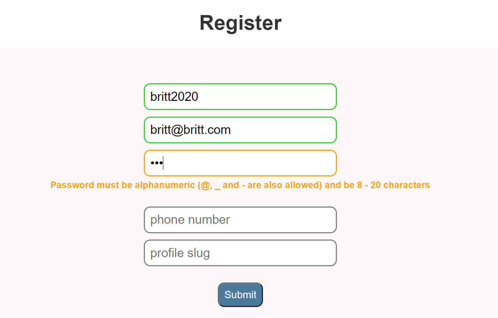

<h1 style="text-align: center;">Form Validation with RegEx</h1>

#### An exercise in using RegEx for form validation, 10.19.2020

#### By Brittany Lindgren

## Description

This project is an exercise in form validation using RegEx tools to limit user input. This project was built by following along with the [Regular Expressions tutorials](https://youtu.be/r6I-Ahc0HB4) created by The Net Ninja.

## Setup/Installation Requirements

* You do not need to run a server to view this document.
* No additional code is necessary to view this project.
* You can either view the code here on github, click on the link above to go to the live page or see the steps below if you want to clone this project and mess around with the code.
* To clone: 
1. Open a code editor (vs code, atom, etc.)
2. Open the terminal in the editor
3. Enter the command `git clone PROJECTLINK` in the terminal
4. _Enjoy_!

## Known Bugs / Issues

There are no known bugs at this time. 

## Support and contact details

Please feel free to contact me through GitHub (username: LINDGRENBA) with any questions, ideas or concerns.

## Technologies Used

* HTML5
* CSS3
* JavaScript
* VS Code
* Git and GitHub

### License

*This site is licensed under the MIT license.*

Copyright (c) 2020 **_Brittany A Lindgren_**